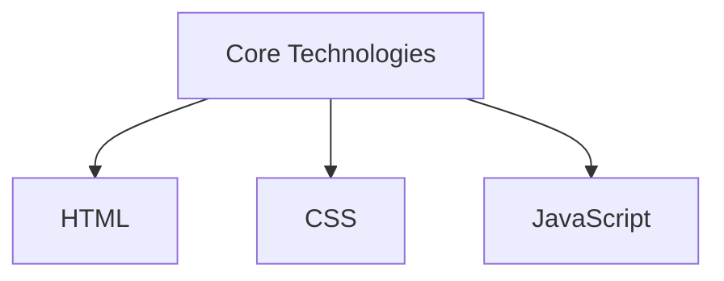
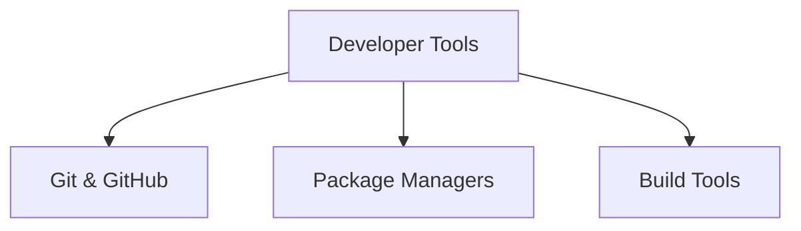
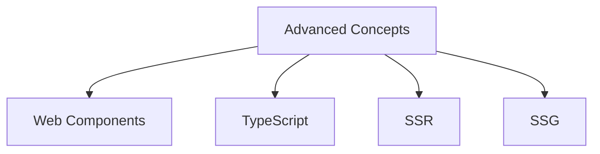
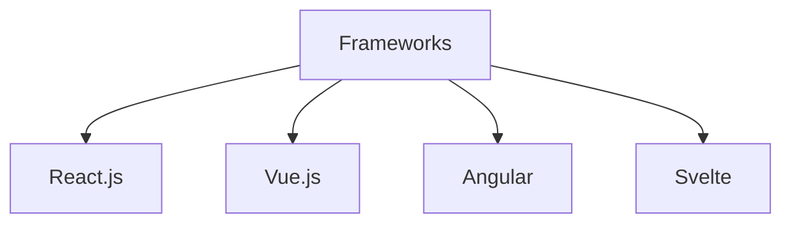
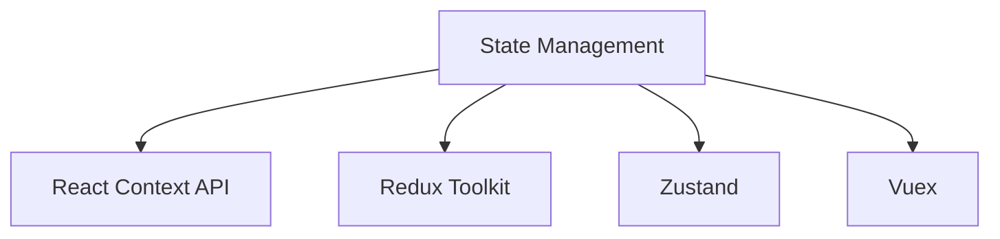
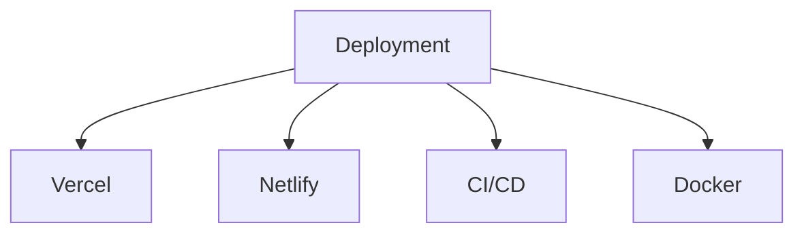
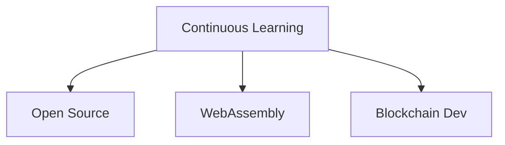

# Frontend Development Roadmap

---

## Table of Contents

1. **Introduction**  
2. **Core Technologies**  
3. **Developer Tools**  
4. **Advanced Frontend Concepts**  
5. **Frameworks and Libraries**  
6. **State Management**  
7. **Performance Optimization**  
8. **Testing and Debugging**  
9. **Security Best Practices**  
10. **Building Real-World Projects**  
11. **Deployment and DevOps**  
12. **Continuous Learning and Growth**  

---

## 1. Introduction

Frontend development focuses on creating user interfaces and experiences. Mastering frontend requires proficiency in various technologies, tools, and best practices.

---

## 2. Core Technologies

| Technology | Key Concepts |
|------------|-------------|
| **HTML** | Semantic HTML, Forms and Validation, Accessibility (ARIA) |
| **CSS** | Box Model, Flexbox, Grid, Responsive Design, Preprocessors (SASS/SCSS) |
| **JavaScript** | ES6+ Features, DOM Manipulation, Event Handling, Fetch API, Async/Await, Closures |

---

## 3. Developer Tools

| Tool | Usage |
|------|-------|
| **Git & GitHub** | Version control, collaboration |
| **Package Managers** | npm, yarn (Dependency management) |
| **Build Tools** | Vite, Webpack, Parcel (Optimizing assets) |
| **Code Quality** | Prettier, ESLint (Formatting & Linting) |

---

## 4. Advanced Frontend Concepts

| Concept | Purpose |
|---------|---------|
| **Web Components** | Reusable UI components |
| **TypeScript** | Statically typed JavaScript |
| **Server-Side Rendering (SSR)** | Faster page loads, SEO benefits |
| **Static Site Generation (SSG)** | Prebuilt pages for speed and performance |

---

## 5. Frameworks and Libraries

| Framework | Key Features |
|-----------|-------------|
| **React.js** | Components, Hooks, Context API |
| **Vue.js** | Directives, Vuex, Composition API |
| **Angular** | Modules, Dependency Injection, RxJS |
| **Svelte** | Reactivity, Stores, SvelteKit |

---

## 6. State Management

| Method | Use Case |
|--------|---------|
| **React Context API** | Basic state management |
| **Redux Toolkit** | Scalable global state management |
| **Zustand** | Minimalistic state management |
| **Recoil** | Alternative to Redux |
| **Vuex** | Vue.js state management |

---

## 7. Performance Optimization

- **Code Splitting & Lazy Loading**  
- **Virtual DOM Optimization**  
- **Image Optimization (WebP, AVIF)**  
- **Caching Strategies (Service Workers, IndexedDB)**  

---

## 8. Testing and Debugging

| Type | Tools |
|------|------|
| **Unit Testing** | Jest, Mocha, AVA |
| **Integration Testing** | Cypress, Playwright |
| **Debugging** | Browser DevTools |

---

## 9. Security Best Practices

- **Cross-Site Scripting (XSS) Prevention**  
- **Cross-Site Request Forgery (CSRF) Protection**  
- **Content Security Policy (CSP)**  

---

## 10. Building Real-World Projects

| Project | Technologies |
|---------|-------------|
| **Portfolio Website** | HTML, CSS, JavaScript |
| **Weather App** | React, API Integration |
| **Task Manager** | React + Redux |
| **E-Commerce Store** | Next.js + GraphQL |
| **Admin Dashboard** | TypeScript + Tailwind |

---

## 11. Deployment and DevOps

| Service | Purpose |
|---------|--------|
| **Vercel** | Serverless hosting |
| **Netlify** | JAMstack deployments |
| **GitHub Actions** | CI/CD pipelines |
| **Docker** | Containerization |

---

## 12. Continuous Learning and Growth

- **Contribute to Open Source**  
- **Explore WebAssembly (WASM)**  
- **Learn Web 3.0 & Blockchain Development**  

---

## Frontend Development Roadmap Diagram

```mermaid
graph LR;
  Start(HTML & CSS) --> JavaScript;
  JavaScript --> Git;
  Git --> Preprocessors;
  Preprocessors --> TypeScript;
  TypeScript --> Frameworks[React/Vue/Angular/Svelte];
  Frameworks --> StateManagement[Redux/Zustand/Recoil];
  StateManagement --> Testing[Jest/Cypress];
  Testing --> Security[XSS/CSRF];
  Security --> PerformanceOptimization[Code Splitting, Caching];
  PerformanceOptimization --> Deployment[Vercel/Netlify];
  Deployment --> Learning[Open Source, WebAssembly];
```

---
